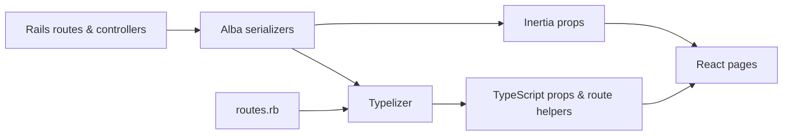

<div align="center">

# Rails + Inertia + React + Astryx Starter Kit

A modern, full-stack foundation for building Rails applications with a React frontend and a
polished Astryx UI—without maintaining a separate API.

[](https://rubyonrails.org)
[](https://www.ruby-lang.org)
[](https://react.dev)
[](https://www.typescriptlang.org)
[](https://www.npmjs.com/package/@astryxdesign/core)
[](LICENSE)

</div>

## Why this starter kit?

Rails is excellent at owning the application: routes, data, jobs, mail, security, and deployment.
React is excellent at building interactive interfaces. Inertia connects the two, passing data from
Rails controllers directly to React pages as props.

This starter kit brings that workflow together with authentication, account settings, type-safe
props and routes, server-side rendering, tests, CI, and container deployment already configured.
It is a practical starting point you can shape into your own product.

## What's included

|                          |                                                                                           |
| ------------------------ | ----------------------------------------------------------------------------------------- |
| **Accounts**             | Sign up, sign in, email verification, password reset, profile and avatar management       |
| **Security**             | Rate-limited sign-in, policy-based authorization, secure cookies, session revocation      |
| **Settings**             | Profile, email, password, active sessions, account deletion, light/dark/system appearance |
| **Developer experience** | Typed Inertia props, typed Rails route helpers, React Compiler, fast Vite development     |
| **Infrastructure**       | SQLite, database-backed cache/jobs/websockets, Active Storage, SSR, Docker and Kamal      |
| **Quality**              | RSpec, browser tests, linting, type checking, security scans, CI and Dependabot           |

## Quick start

You need Ruby 4.0.1 and Node.js 22. The app uses SQLite by default.

```bash
bin/setup
```

The setup script installs dependencies, prepares the database, and starts the development server.
Open <http://localhost:3000>.

For local development only, the seed data includes this demo account:

```text
dev@example.com
password123456
```

Development emails open in the browser instead of being delivered. To prepare the project without
starting the server, run `bin/setup --skip-server`. Use `bin/setup --reset` when you want to rebuild
the local database from scratch.

## How it works



Rails remains the source of truth for routing, authentication, authorization, and data loading.
[Inertia](https://inertiajs.com) turns controller responses into React page props, so there is no
separate API or client-side router to maintain. [Alba](https://github.com/okuramasafumi/alba)
defines the prop shape, while [Typelizer](https://github.com/skryukov/typelizer) generates matching
TypeScript interfaces and typed route helpers.

## Stack

| Area        | Tools                                                   |
| ----------- | ------------------------------------------------------- |
| Backend     | Ruby 4.0, Rails 8.1, Puma, SQLite                       |
| Frontend    | React 19, TypeScript 6, Inertia 3, Vite 8               |
| UI          | Astryx, Tailwind CSS 4, Lucide icons                    |
| Application | Alba, Typelizer, Action Policy, Pagy, Active Storage    |
| Testing     | RSpec, Capybara, Selenium, headless Chrome              |
| Delivery    | SSR, Propshaft, Thruster, Docker, Kamal, GitHub Actions |

The default Rails Solid adapters keep cache, background jobs, and websockets in the database, so
the starter kit does not require Redis.

## Project conventions

Application pages live in `app/javascript/pages`, with persistent layouts and shared components
alongside them. The `@/` import alias points to `app/javascript`.

Inertia props are defined by serializers in `app/serializers`. When you change a serializer or
`config/routes.rb`, regenerate the frontend types:

```bash
bin/rails typelizer:generate:refresh
```

> [!IMPORTANT]
> Do not edit files under `app/javascript/routes` or
> `app/javascript/types/serializers`. They are generated, and CI verifies that committed output is
> current.

Authorization policies live in `app/policies` and are enforced on the server. Permission verdicts
can also be serialized to the frontend so the interface and controller follow the same rules.

## Useful commands

| Command                 | Purpose                              |
| ----------------------- | ------------------------------------ |
| `bin/dev`               | Run Rails and Vite                   |
| `bin/rspec`             | Run the test suite                   |
| `bin/rspec spec/system` | Run browser tests in headless Chrome |
| `npm run check`         | Type-check the frontend              |
| `npm run lint`          | Lint JavaScript and TypeScript       |
| `npm run format`        | Check frontend formatting            |
| `bin/rubocop`           | Check Ruby style                     |
| `bin/brakeman`          | Scan Rails code for security issues  |
| `bin/bundler-audit`     | Check gems for known vulnerabilities |
| `bin/ci`                | Run the complete local CI pipeline   |

## Deployment

The project ships as a Docker image and is configured for
[Kamal](https://kamal-deploy.org). Before the first deployment, replace the
`REPLACE_WITH_*` values in [`config/deploy.yml`](config/deploy.yml) and provide the secrets declared
in [`.kamal/secrets`](.kamal/secrets).

```bash
bin/kamal setup
bin/kamal deploy
```

Server-side rendering is enabled by default and included in production images. GitHub deployment is
disabled until you deliberately enable [the deployment workflow](.github/workflows/deploy.yml).

## Working with coding agents

[`AGENTS.md`](AGENTS.md) contains the repository rules for coding agents: consult current official
documentation, use supported framework APIs, debug systematically, and verify before claiming
completion.

## Credits

Originally generated by [inertia-rails/generator](https://github.com/inertia-rails/generator),
which is based on the [Laravel React Starter Kit](https://github.com/laravel/react-starter-kit) and
built by [Evil Martians](https://evilmartians.com).

## License

Available as open source under the terms of the [MIT License](LICENSE).
